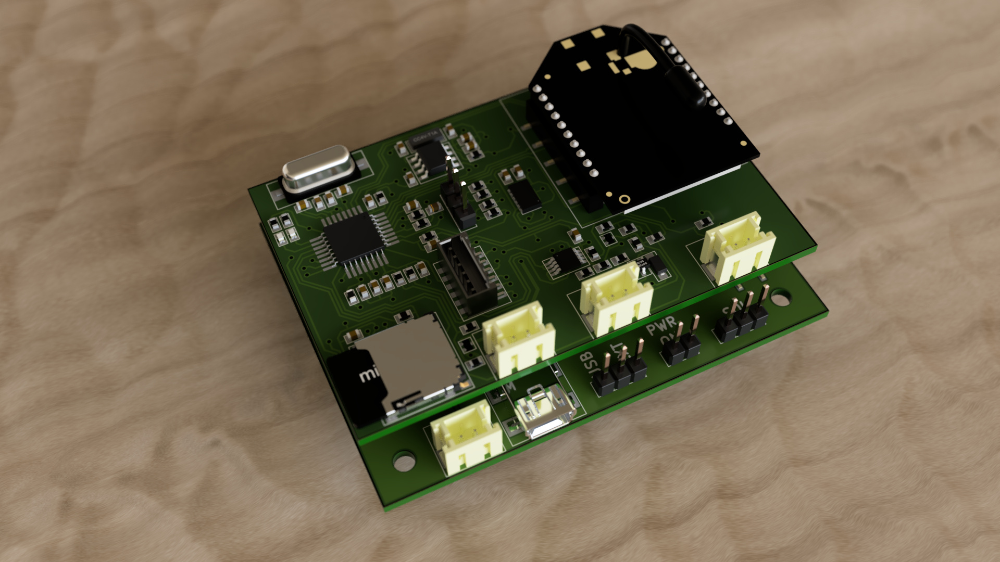
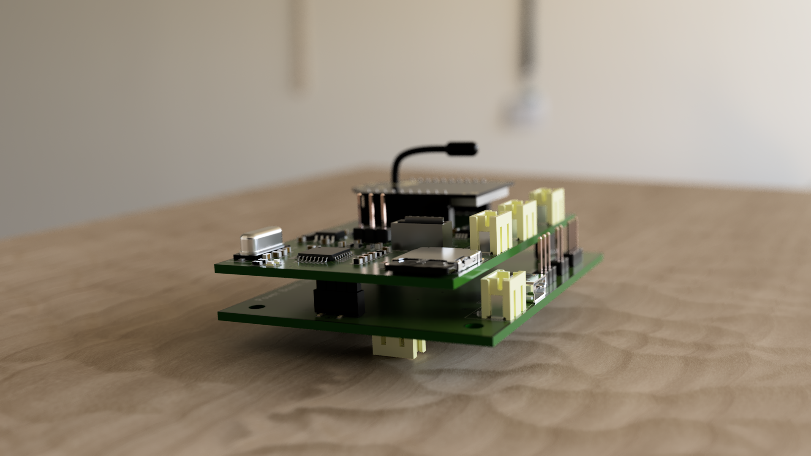
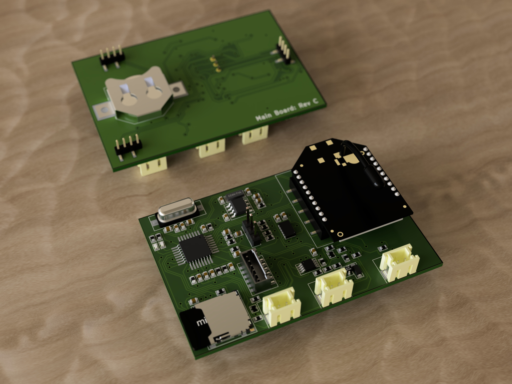
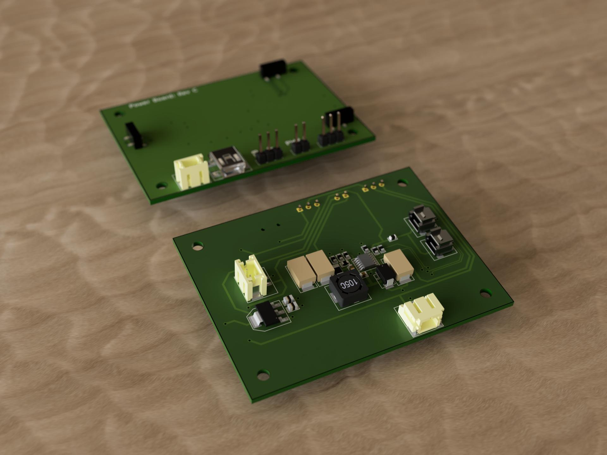
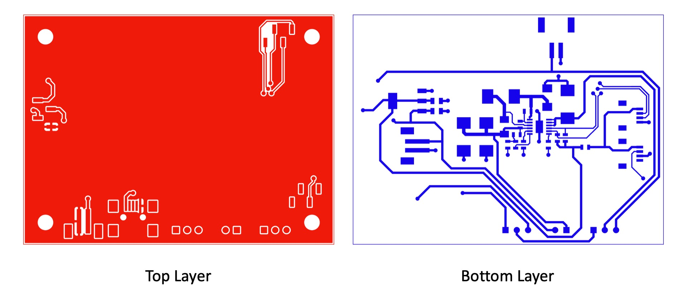

# Instrumentation Buoy Data Logger

## Introduction

The client which I worked with in this project was working on a new concept to grow seaweed at an industrial scale (approximately 100km by 100km) in deep ocean waters tens of kilometers offshore. The seaweed plantation is kept afloat using buoys. One of the biggest chanllenge the client wanted to solve was how to keep the water near the surface of the ocean oxygenated to allow seaweed to grow. One idea was to use the motion of ocean waves to generate compressed air, which can be harnessed to pump air into the water to keep it oxygenated.

To aid in understanding how compressed air can be generated from ocean waves, a Instrumentation Buoy Data Logger was designed to measure various ocean metrics and record the data to a microSD card. The data logger had the following capabilities:
- Can measure water level and depth relative to the buoy.
- Can measure accelerations in all three spacial dimensions.
- Allows two pressure sensors to be connected to the board (via connectors located on the PCB)
- Designed to be completely solar powered. It is powered by an array of solar panels and a rechargeable 18650 Li-ion battery.
- A microSD card is used for data storage, but data transfer is done completely wirelessly using a XBee wireless module. The XBee module also allows over the air firmware updates. The solar-power and wireless capabilities of the data logger are necessary as the electronics will be permanently sealed away inside the buoy to ensure the electronics compartment is water-tight.

The data logger consists of two PCB assemblies sandwitched together. The smaller board is the Main Board. It contains the microcontroller, wireless module, and other digital electronics. The larger board is the Power Board whic contains all the power electronics for solar charging. The entire PCB assembly is designed to be mounted in a prototype buoy, and deployed in the ocean to collect data.

The client has agreed to open source the designs.

## Gallery

## PCB Assemblies

## PCB Flats

## Copper Layers

