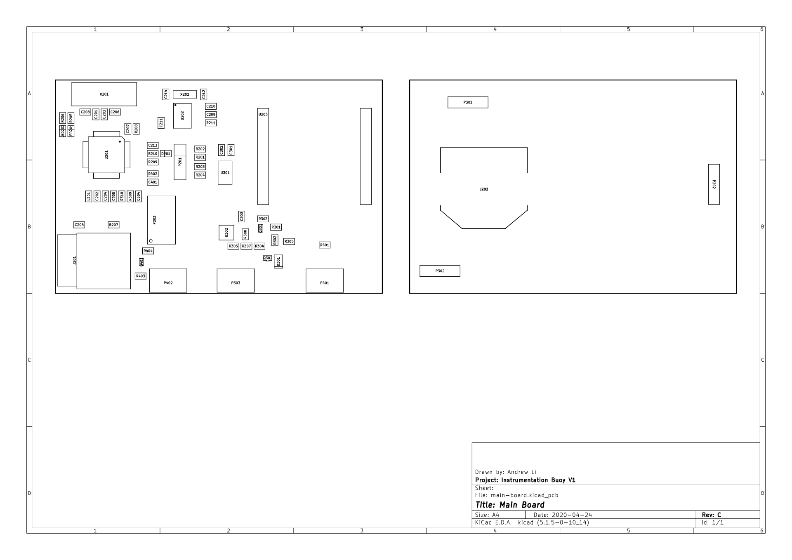

# Assembly Files

## Assembly Drawing

## Bill of Materials

| Reference                                                 	|  Quantity 	| Internal Part Number 	|  Component Value 	|  Manufacturer                	|  MPN      	|  Part Description                                                 	|
|-----------------------------------------------------------	|-----------	|----------------------	|------------------	|------------------------------	|--------------------------------	|-------------------------------------------------------------------	|
| C201 C210 C301                                            	| 3         	| ECS00052             	| 1uF              	| Murata                       	| GRM188R61H105KAALD             	| 1uF, 0603, 10%, 50V, X5R, Ceramic                                 	|
| C203 C202 C204 C207 C205 C213 C302 C305   C304 C303 C401  	| 11        	| ECS00075             	| 100nF            	| Murata                       	| GRM188R71C104KA01D             	| 100nF, 0603, 10%, 16V, X7R, Ceramic                               	|
| C206 C208                                                 	| 2         	| ECS00077             	| 20pF             	| Kemet                        	| C0603C200J5GACTU               	| 20pF, 0603, 5%, 50V, NP0, Ceramic                                 	|
| C209 C211                                                 	| 2         	| ECS00078             	| 220nF            	| Murata                       	| GRM188R71A224KA01D             	| 220nF, 0603, 10%, 10V, X7R, Ceramic                               	|
| C212 C214                                                 	| 2         	| ECS00076             	| 9pF              	| Multicomp                    	| MC0603N9R0D500CT               	| 9pF, 0603, ±5pF, 50V, NP0, Ceramic                               	|
| D201                                                      	| 1         	| ECS00037             	| ~                	| Bourns                       	| CD0603-B0240                   	| Schottky, Single, 0.1A, SMD                                       	|
| D301                                                      	| 1         	| ECS00072             	| 1.8V             	| On Semiconductor             	| MMSZ4678T1G                    	| Zener, 1.8V, 0.25W, SMD                                           	|
| J201                                                      	| 1         	| ECS00065             	| ~                	| Amphenol Commercial Products 	| 114-00841-68                   	| Micro SD Card Holder, SMD                                         	|
| J202                                                      	| 1         	| ECS00094             	| 16mm             	| Memory Protection Devices    	| BK-868                         	| Retainer, 16mm Diameter Cell, SMD                                 	|
| L201                                                      	| 1         	| ECS00074             	| 1kK @ 100MHz     	| Murata                       	| BLM18TG102TN1D                 	| 1K @ 100MHz, 0603, 0.1A, 0R6                                      	|
| LED201 LED202                                             	| 2         	| ECS00035             	| Red              	| Rohm                         	| SML-310VTT86L                  	| Red, 4mcd, 0603                                                   	|
| P201                                                      	| 1         	| ECS00013             	| 3x1              	| Molex                        	| 22-28-4030                     	| 3-way, header, 2.54mm pitch, vertical, through hole, KK Series    	|
| P202 P302 P301                                            	| 3         	| ECS00029             	| 4x1              	| Global Connector Technology  	| BF040-04A-B2-0400-0260-0483-LD 	| 4-way, header, 2mm pitch, 4mm height, vertical, SMD, BF040 Series 	|
| P203                                                      	| 1         	| ECS00015             	| 6x1              	| Molex                        	| 87437-0673                     	| 6-way, header, 1.5mm pitch, vertical, SMD, Pico-SPOX Series       	|
| P303 P401 P402                                            	| 3         	| ECS00067             	| 2x1              	| JST                          	| B2B-PH-SM4-TB(LF)(SN)          	| 2-way, header, 2mm pitch, vertical, SMD, PH Series                	|
| Q301 Q401                                                 	| 2         	| ECS00087             	| ~                	| On Semiconductor             	| NTA4153NT1G                    	| MOSFET, N-Channel, 0.915A, 0R127                                  	|
| Q302                                                      	| 1         	| ECS00073             	| ~                	| NXP                          	| BC857BW,115                    	| BJT, PNP, 45V, 0.1A                                               	|
| R201 R211                                                 	| 2         	| ECS00086             	| 4K7              	| Bourns                       	| CR0603-FX-4701ELF              	| 4K7, 0603, 1%, 0.063W, Thick Film                                 	|
| R202 R207 R208 R204 R301 R403                             	| 6         	| ECS00045             	| 10K              	| Panasonic                    	| ERJ3GEYJ103V                   	| 10K, 0603, 5%, 0.1W, Thick Film                                   	|
| R203 R307 R308 R306 R305 R401                             	| 6         	| ECS00085             	| 56K              	| Vishay                       	| CRCW060356K0FKEAHP             	| 56K, 0603, 1%, 0.25W, Thick Film, High Power                      	|
| R205 R206                                                 	| 2         	| ECS00081             	| 68R              	| Bourns                       	| CR0603-FX-68R0ELF              	| 68R, 0603, 1%, 0.1W,  Thick Film                                  	|
| R210 R209                                                 	| 2         	| ECS00084             	| 2K2              	| Multicomp                    	| MC0063W060312K2                	| 2K2, 0603, 1%, 0.063W, Thick Film                                 	|
| R302 R309 R310 R402                                       	| 4         	| ECS00083             	| 1K5              	| Bourns                       	| CR0603-FX-1501ELF              	| 1K5, 0603, 1%,  0.1W, Thick Film                                  	|
| R303 R304 R404                                            	| 3         	| ECS00080             	| 36R              	| Vishay                       	| CRCW060336R0FKEA               	| 36R, 0603, 0.1W,  Thick Film                                      	|
| U201                                                      	| 1         	| ECS00017             	| ~                	| Atmel                        	| ATMEGA328P-AU                  	| ATMega328P, TQFP                                                  	|
| U202                                                      	| 1         	| ECS00032             	| ~                	| Texas Instruments            	| BQ32000DR                      	| RTC, 8SOIC                                                        	|
| U203                                                      	| 1         	| ECA00002             	| ~                	| Ciseco PLC                   	| XRF                            	| XRF Wireless UART Serial Data Module                              	|
| U301                                                      	| 1         	| ECS00016             	| ~                	| Analog Device                	| ADXL343BCCZ                    	| Accelerometer, 3 axis                                             	|
| U302                                                      	| 1         	| ECS00030             	| ~                	| Microchip                    	| MCP6042-E/MS                   	| Dual Package, 8-MSOP, Unity Gain Stable                           	|
| X201                                                      	| 1         	| ECS00006             	| 16MHz            	| Fox                          	| FOXSDLF/160-20                 	| Crystal, 16MHz, 30ppm, 20pF, SMD                                  	|
| X202                                                      	| 1         	| ECS00005             	| 32.768kHz        	| Micro Crystal Switzerland    	| CC4V-T1A 32.768KHZ +-20PPM 9PF 	| Crystal, 32.768kHz, 20ppm, 9pF, SMD                               	|
