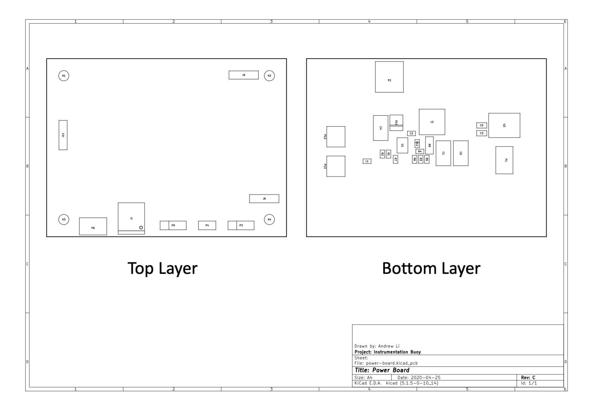

# Assembly Drawing

## Bill of Materials

| Reference  	|  Quantity 	|  Internal Part Number 	|  Component Value 	|  Manufacturer               	| MPN                   	|  Part Description                                                    	|
|------------	|:---------:	|-----------------------	|------------------	|-----------------------------	|-----------------------	|----------------------------------------------------------------------	|
| C1 C4      	|     2     	| ECS00053              	| 10uF             	| AVX                         	| TPSD106K035R0125      	| 10uF, 2917, 10%, 35V, Tantalum                                       	|
| C2         	|     1     	| ECS00052              	| 1uF              	| Murata                      	| GRM188R61H105KAALD    	| 1uF, 0603, 10%, 50V, X5R, Ceramic                                    	|
| C3 C5      	|     2     	| ECS00050              	| 10uF             	| Murata                      	| GRM21BR61A106KE19L    	| 10uF, 0805, 10%, 10V, X5R, Ceramic                                   	|
| C6         	|     1     	| ECS00054              	| 100uF            	| AVX                         	| TPSD107K016R0060      	| 100uF, 2917, 10%, 16V, Tantalum                                      	|
| D11        	|     1     	| ECS00095              	| ~                	| ST Microelectronics         	| STPS2H100A            	| Schottky, Single, 2A, SMD                                            	|
| D12        	|     1     	| ECS00037              	| ~                	| Bourns                      	| CD0603-B0240          	| Schottky, Single, 0.1A, SMD                                          	|
| J1         	|     1     	| ECS00066              	| ~                	| TE Connectivity             	| 1734035-1             	| Mini USB Type B, receptacle                                          	|
| J8 J9 J11  	|     3     	| ECS00059              	| 4x1              	| Global Connector Technology 	| BF090-04-A-1-N-D      	| 4-way, receptacle b-b, 2mm pitch, vertical, SMD, BF040 Series        	|
| L1         	|     1     	| ECS00074              	| 1kK @ 100MHz     	| Murata                      	| BLM18TG102TN1D        	| 1K @ 100MHz, 0603, 0.1A, 0R6                                         	|
| L2         	|     1     	| ECS00071              	| 22uH             	| Murata                      	| 46223C                	| 22uH, 1.8A, 0R12                                                     	|
| P1 P6      	|     2     	| ECS00067              	| 2x1              	| JST                         	| B2B-PH-SM4-TB(LF)(SN) 	| 2-way, header, 2mm pitch, vertical, SMD, PH Series                   	|
| P12 P13    	|     2     	| ECS00068              	| 4x1              	| Molex                       	| 501953-0407           	| 4-way, header, 1mm pitch, right angle, SMD, Pico-Clasp 501953 Series 	|
| P2         	|     1     	| ECS00007              	| 2x1              	| JST                         	| S2B-PH-SM4-TB(LF)(SN) 	| 2-way, header, 2mm pitch, right angle, SMD, PH Series                	|
| P4         	|     1     	| ECS00004              	| 2x1              	| Molex                       	| 22-28-4020            	| 2-way, header, 2.54mm pitch, vertical, through hole, KK Series       	|
| P9 P3      	|     2     	| ECS00013              	| 3x1              	| Molex                       	| 22-28-4030            	| 3-way, header, 2.54mm pitch, vertical, through hole, KK Series       	|
| R2 R1      	|     2     	| ECS00045              	| 10K              	| Panasonic                   	| ERJ3GEYJ103V          	| 10K, 0603, 5%, 0.1W, Thick Film                                      	|
| R3         	|     1     	| ECS00046              	| 215K             	| Panasonic                   	| ERJ3EKF2153V          	| 215K, 0603, 1%, 0.1W, Thick Film                                     	|
| R4         	|     1     	| ECS00048              	| 40K2             	| Panasonic                   	| ERA3ARB4022V          	| 40K2, 0603, 0.1%, 0.1W, Thin Film                                    	|
| R5         	|     1     	| ECS00047              	| 330K             	| Panasonic                   	| ERJ3EKF3303V          	| 330K,  0603, 1%, 0.1W, Thick Film                                    	|
| R7 R6      	|     2     	| ECS00058              	| 0R               	| Panasonic                   	| ERJ3GEY0R00V          	| 0R, 0603, 0.1W, Jumper                                               	|
| R9         	|     1     	| ECS00055              	| 0R12             	| Bourns                      	| CRL1206-FW-R120ELF    	| 0R12, 1206, 1%, 0.25W, Thick Film                                    	|
| U1         	|     1     	| ECS00043              	| ~                	| Linear Technology           	| LT3652EMSE#PBF        	| Switch Mode Charge Controller with MPPT                              	|
| U2         	|     1     	| ECS00036              	| ~                	| On Semiconductor            	| NCP1117ST33T3G        	| 3.3V Linear Regulator                                                	|
